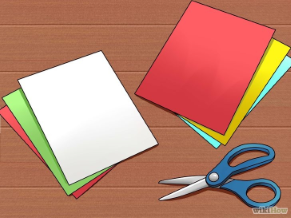
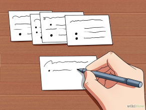
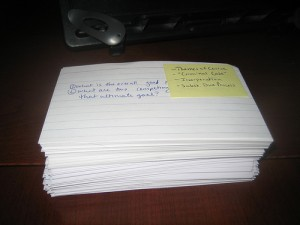
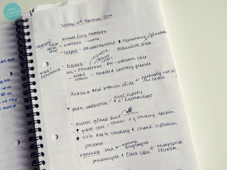

#Flashcards:
 Making flashcards is a sure-shot way of remembering those boring formulas/protocols/packet formats/whatever.
 
 **A Flashcard is essentially a Question-Answer pair.**
 
 **How to make flashcards:**
 
 - Grab some sheets of A4 paper (blank on both sides).
 - Cut the sheet into 8 rectangles.
 
 - On each piece
     + Write a single Question on Front side
     + Write the answer on the Back side
     > For example:
     > **Card 1:**
     > Front: What is the sum of first 'n' natural numbers?
     > Back: n(n+1)/2
     > **Card 2:**
     > Front: What is the sum of first 'n' odd numbers?
     > Back: n^2
      
      
 - Stack all the cards into a deck, **Question side up**.
 
 
 **How to study the flashcards:**

 - Go through each card. Look at the question and try to answer it.
 - Flip the card to reveal the answer.
 - Check if you were right.
     + Got the answer correct, easily (<5 seconds): Put the card into a separate stack called **Easy**
     + Got the answer correct, but had difficulty (>=5 seconds): Put the card into a stack called **Hard**
     + Failed to answer correctly: Put the card into a separate stack called **Again**
 - Go through all the cards this way.
 - Now, you have 3 decks: **Easy**, **Hard**, **Again**
     + Easy deck: Go through it again after 3 days.
     + Hard deck: Go through it again tomorrow.
     + Again deck: Cycle through the cards repeatedly until you can remember them all without mistake. (Keep cycling until you do, shuffle the pack after each cycle).
     Once you can remember each card in the Again deck, review the Again deck tomorrow.
     > For future days, repeat the same process for each deck. (All again cards from each deck will go into 1 new again deck, don't create nested sub-decks.)
 This method of review will give you close to 100% retention even on the most boring and daunting stuff.
*************

#On-Screen Calculator:
 Make sure you familiarize yourself with every part of the on-screen, point-and-click calculator that GATE 2016 features.

 ** http://www.gate.iisc.ernet.in/?page_id=762 **

 **Demo:**
 > DEMOHERE
 
 http://jam.iitm.ac.in/jam2016/pdfs/scienti.pdf
 http://gateoverflow.in/21219/how-to-find-logarithmic-values-in-gate-exam
 https://drive.google.com/file/d/0BxfQqBdt-h66emxyRURxQWZ2Z1k/view
*************

#Utilize every minute:
 Never leave the question paper until you run out of time.
 **The GATE interface will submit your answers automatically.**

 There will be many questions in GATE that can be solved by brute-forcing.
 Some questions contain important clues that can reveal the answer to other questions.
*************

#Time Management:
 GATE is not a race against time (65 questions/100 marks in 180 minutes).
 However, if you wish to have some time to verify your answers, or if you wish to brute-force those last few questions, you need to improve your speed.

 Thus, in future mock tests, try to experiment with time management.
 **Try different strategies.**

 - In one paper, try doing the 1 mark question before 2 marks. See how it goes.
 - In some other attempt, do the paper in 3 passes
     + 1st - Questions which you know you can solve within 1 minute
     + 2nd - Questions that are lengthy or confusing
     + 3rd - Questions you know nothing about
 - In some other attempt, try skipping any question that takes more than 1 minute for later.
 Try out other strategies. See which works best.
*************

#Organize your rough copy:
 You will be provided with some stationary during your exam. Always bring your own pens.
 **Practice keeping your rough copy organized.**
 In GATE, it is essential, because if you want to go back to a question, an organized rough copy means  you can quickly start from where you left the question.
 
 **Don't overdo it though.**
*************

#Automate things:
 If you're living in a hostel/rented flat, and you don't have access to a mess (you go out to eat), consider getting your food delivered to you in the last week.
 It will cost you a bit more, but it will save a lot of valuable time.
 *************

#Pee before you enter the exam hall:
 Don't take water bottles. You won't get time to drink water during the exam.
 
*************

#Take some medicine:
**If you've asthma or some similar condition, take your medicine with you!**
 A lot of students get asthma attacks due to high stress and tensions of the exam.
 
 Also, irrespective of whether you're feeling well or not, pop a Crocin (or similar). A single tablet won't kill you, but it will prevent you from catching last minute fevers.

 Also, eat some chocolate. Or mint (Mentos/Polo. Mint keeps your mind alert.)